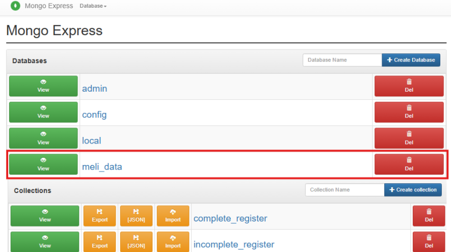
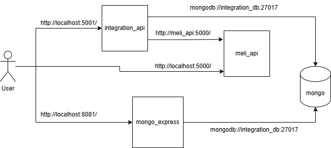
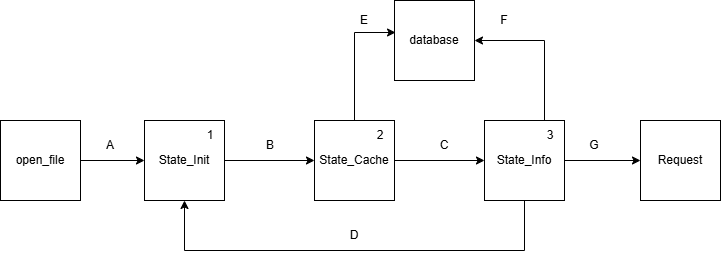
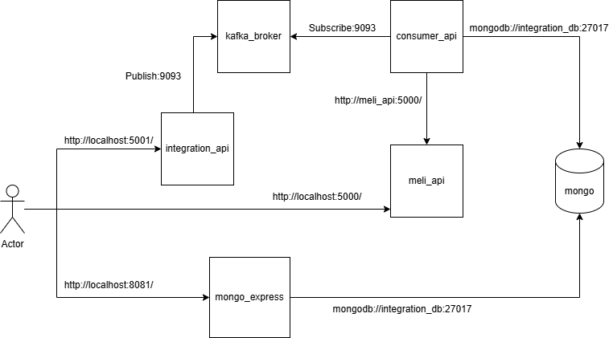
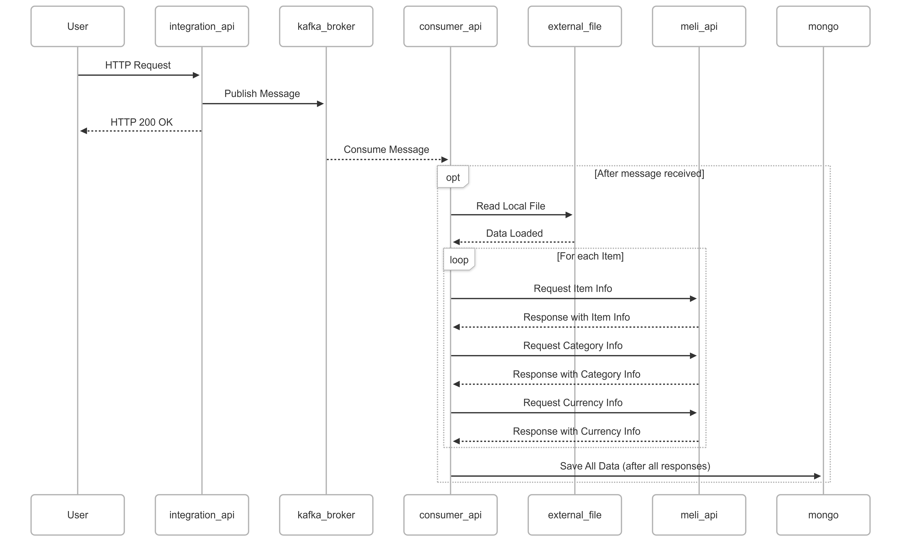

## 📑 Tabla de Contenido

- [🚀 Instrucciones para Ejecutar el Proyecto](#-instrucciones-para-ejecutar-el-proyecto)
  - [Requisitos Previos](#requisitos-previos)
  - [Pasos para Ejecutar](#pasos-para-ejecutar)
  - [🔗 Probar las APIs](#-probar-las-apis)
    - [1. **Actualizar registros en Mongo desde el archivo  cargado**](#1-actualizar-registros-en-mongo-desde-el-archivo--cargado)
      - [📁 Archivos de ejemplo](#-archivos-de-ejemplo)
      - [🔧 Parámetros opcionales:](#-parámetros-opcionales)
    - [2. 📊 **Entrar al GUI de Mongo para visualizar datos**](#2--entrar-al-gui-de-mongo-para-visualizar-datos)
    - [3 🌐 **Endpoints Disponibles en la aplicacion MELI API**](#3--endpoints-disponibles-en-la-aplicacion-meli-api)
    - [🔹 `/items` - Consulta de Ítems](#-items---consulta-de-ítems)
    - [🔹 `/categories` - Consulta de Categorías](#-categories---consulta-de-categorías)
    - [🔹 `/currencies` - Consulta de Monedas](#-currencies---consulta-de-monedas)
    - [Soluciones del ejercicio propuesto](#soluciones-del-ejercicio-propuesto)
      - [Solucion A:](#solucion-a)
      - [🔗 Diagrama de Componentes](#-diagrama-de-componentes)
      - [🔄 Diagrama de Estados](#-diagrama-de-estados)
      - [Solucion B:](#solucion-b)
      - [🔗 Diagrama de Componentes](#-diagrama-de-componentes-1)
      - [🔄 Diagrama de Secuencia](#-diagrama-de-secuencia)
    - [🚀 Mejoras a implementar](#-mejoras-a-implementar)
    - [⚙️ Arquitectura y Diseño](#️-arquitectura-y-diseño)
    - [📁 Estructura del Código](#-estructura-del-código)
- [📘 Desafío Teórico](#-desafío-teórico)
  - [1. Procesos, hilos y corrutinas](#1-procesos-hilos-y-corrutinas)
    - [● Un caso en el que usarías procesos para resolver un problema y por qué](#-un-caso-en-el-que-usarías-procesos-para-resolver-un-problema-y-por-qué)
    - [● Un caso en el que usarías threads para resolver un problema y por qué](#-un-caso-en-el-que-usarías-threads-para-resolver-un-problema-y-por-qué)
    - [● Un caso en el que usarías corrutinas para resolver un problema y por qué](#-un-caso-en-el-que-usarías-corrutinas-para-resolver-un-problema-y-por-qué)
  - [2. Optimización de recursos del sistema operativo](#2-optimización-de-recursos-del-sistema-operativo)
    - [● Si tuvieras 1.000.000 de elementos y tuvieras que consultar para cada uno de ellos información en una API HTTP. ¿Cómo lo harías? Explicar.](#-si-tuvieras-1000000-de-elementos-y-tuvieras-que-consultar-para-cada-uno-de-ellos-información-en-una-api-http-cómo-lo-harías-explicar)
  - [3. Análisis de complejidad](#3-análisis-de-complejidad)
    - [● Dados 4 algoritmos A, B, C y D que cumplen la misma funcionalidad, con complejidades O(n²), O(n³), O(2ⁿ) y O(n log n), respectivamente, ¿Cuál de los algoritmos favorecerías y cuál descartarías en principio? Explicar por qué.](#-dados-4-algoritmos-a-b-c-y-d-que-cumplen-la-misma-funcionalidad-con-complejidades-on-on-o2ⁿ-y-on-log-n-respectivamente-cuál-de-los-algoritmos-favorecerías-y-cuál-descartarías-en-principio-explicar-por-qué)
    - [● Asume que dispones de dos bases de datos para utilizar en diferentes problemas a resolver. La primera, llamada AlfaDB, tiene una complejidad de O(1) en consulta y O(n²) en escritura. La segunda, llamada BetaDB, tiene una complejidad de O(log n) tanto para consulta como para escritura. Describe, en forma sucinta, qué casos de uso podrías atacar con cada una.](#-asume-que-dispones-de-dos-bases-de-datos-para-utilizar-en-diferentes-problemas-a-resolver-la-primera-llamada-alfadb-tiene-una-complejidad-de-o1-en-consulta-y-on-en-escritura-la-segunda-llamada-betadb-tiene-una-complejidad-de-olog-n-tanto-para-consulta-como-para-escritura-describe-en-forma-sucinta-qué-casos-de-uso-podrías-atacar-con-cada-una)


# 🚀 Instrucciones para Ejecutar el Proyecto

Este proyecto utiliza Docker para levantar dos APIs en Flask y una base de datos MongoDB junto con mongo-express, una interfaz web para explorar los datos de Mongo. Sigue estos pasos para correrlo desde cero:

## Requisitos Previos

- Tener instalado Docker y Docker Compose.

## Pasos para Ejecutar

1. **Clonar el repositorio**

```bash
git clone https://github.com/JassonM0lina/technical_challenge_meli
cd technical_challenge_meli
```

2. **Levantar los contenedores**

```bash
docker-compose  -f docker-compose.yaml up --build
```

Esto construirá y levantará los siguientes servicios:

- 🐍 **meli_api** (puerto `5000`): API para consultar información de productos en Mercado Libre
- 🧪 **integration_api** (puerto `5001`): API para actualizar la base de datos en MongoDB. 
- 🍃 **MongoDB** (puerto `27017`): Base de datos que almacena la información.
- 📊 **mongo-express** (puerto `8081`): Interfaz web para visualizar los datos en Mongo.

> **Usuario/Contraseña para mongo-express:** `admin` / `admin`


3. **Verificar el estado de los servicios**
   Puedes usar el siguiente comando para ver los logs y verificar que todo está corriendo correctamente:

```bash
docker-compose logs -f
```

4. **Detener los servicios**

```bash
docker-compose  -f docker-compose.yaml down v 
```
## 🔗 Probar las APIs

Una vez los servicios estén corriendo, puedes probar las APIs con `curl` o Postman.


### 1. **Actualizar registros en Mongo desde el archivo  cargado**

```bash
POST: http://localhost:5001/update
```

Body JSON:
```json
{
  "name_file": "datalake.csv",
  "format": "csv",
  "separator": ",",
  "encoding": "utf-8"
}
```
#### 📁 Archivos de ejemplo

En la carpeta `./integration_api/fetch_integrate/domain/assets` se encuentran **cuatro archivos** que contienen la misma información de los campos `"site"` e `"id"` de los ítems:

- `datalake.csv`: formato **`csv`**, separador **`,`**
- `datalake_semicolon.csv`: formato **`csv`**, separador **`;`**
- `datalake.txt`: formato **`txt`**, separador **`,`**
- `datalake.jsonl`: formato **`jsonl`**

> 📌 Si desea probar un nuevo archivo, por favor ubíquelo en la misma carpeta:  
> `./integration_api/fetch_integrate/domain/assets`


#### 🔧 Parámetros opcionales:

- `register_attributes`: lista de atributos que deseas guardar en Mongo. Si no se especifica, el valor por defecto es:
  ```json
  ["price", "name", "description"]
  ```
  - Si se agrega un atributo que no está soportado, se insertará como `null` en Mongo y se almacenará en la colección `incomplete_register`.
  - Si se omite alguno de los atributos por defecto, el registro estará en `complete_register` pero sin ese atributo.
  - Los únicos atributos que **siempre** estarán presentes son `id` y `site`.

- `len_batch`: número de elementos que se procesarán por cada solicitud a la API de MELI. Valor por defecto: `50`.
  - Se ajustó este parámetro para evitar superar el límite de caracteres en peticiones HTTP (usualmente no más de 2000 caracteres por GET).

  Body JSON con parámateros opcionales:

```json
{
  "register_attributes": ["price", "name", "description"],
  "len_batch": 50,
  "name_file": "datalake.csv",
  "format": "csv",
  "separator": ",",
  "encoding": "utf-8"
}
```

---
### 2. 📊 **Entrar al GUI de Mongo para visualizar datos**

```bash
http://localhost:8081/
```

Una vez se haya hecho el POST a http://localhost:5001/update, se puede ingresar a http://localhost:8081/, que corresponde al servicio de Mongo Express, y allí podrá visualizar la información cargada en la base de datos de MongoDB.



---

### 3 🌐 **Endpoints Disponibles en la aplicacion MELI API**

La aplicación expone tres endpoints HTTP `GET` para consultar información directamente desde la API de Mercado Libre según el tipo de entidad: ítems, categorías o monedas.

### 🔹 `/items` - Consulta de Ítems

Este endpoint permite consultar múltiples ítems de Mercado Libre junto con los atributos deseados. Este endpoint simula el API de mercado libre y la data se guarda como `meli_items_data.json`.

```bash
GET: http://localhost:5000/items
URL_EJEMPLO = /items?ids=MLA750925229,MLA845041373,MLA693105237&attributes=id,title,price
```

**Parámetros:**
- `ids` (requerido): lista separada por comas de IDs de productos de Mercado Libre.
- `attributes` (opcional): lista separada por comas de atributos específicos que deseas obtener por cada ítem (ej. `id`, `title`, `price`, `description`, etc.).

**Respuesta:**  
Un JSON con los datos solicitados para cada ítem.  


### 🔹 `/categories` - Consulta de Categorías

Este endpoint permite obtener información de las categorías de productos. Este endpoint simula el API de mercado libre y la data se guarda como `meli_categories_data.json`.

```bash
GET: http://localhost:5000/categories
URL_EJEMPLO = http://localhost:5000/categories?ids=CAT275
```

**Parámetros:**
- `ids` (requerido): ID de la categoría de Mercado Libre.

**Respuesta:**  
Un JSON con los datos de la categoría correspondiente.  

### 🔹 `/currencies` - Consulta de Monedas


```bash
GET: http://localhost:5000/currencies
URL_EJEMPLO = http://localhost:5000/currencies?ids=CUR462
```
**Parámetros:**
- `ids` (requerido): ID de la moneda que deseas consultar.

**Respuesta:**  
Un JSON con los datos de la moneda especificada.  

---
### Soluciones del ejercicio propuesto

Dado que el enunciado del challege meniona que en genral no se debe usar librerias cuando un modulo built-in lo puede resolver, se proponen dos soluciones:

A. **La primera solucion** solo usa las librerias de flask, pymongo y request. Por tanto, es necesario usar multiprocesingde Python para liberar la solicitud del usuario y permitir que el procesamiento se realice de forma asíncrona.

B. **La segunda solucion** Esta solución plantea el uso conjunto de Kafka y Apache Spark. Al publicar la petición en Kafka, el sistema responde de forma asíncrona, liberando inmediatamente al usuario, mientras que el procesamiento de los datos se realiza en segundo plano. Gracias a la arquitectura distribuida de Apache Spark, basada en clústeres, los mensajes pueden ser consumidos en paralelo, lo que permite leer, procesar, realizar peticiones HTTP y actualizar la base de datos de manera eficiente.

#### Solucion A:

#### 🔗 Diagrama de Componentes

En la siguiente imagen podemos observar un **diagrama de componentes**, junto con los **puertos y URLs** a través de los cuales cada componente se comunica entre sí, incluyendo la interacción del usuario:



---

#### 🔄 Diagrama de Estados

En el siguiente diagrama se puede observar el **diagrama de estados** que el programa sigue para la separación de responsabilidades. A continuación, se describe el flujo del sistema:

1. **Estado 1 - `State_Init`**: Se encarga de recivir el archivo de texto fila por fila (**A**) y, cuando se acumula un batch de `x` filas (normalmente 50), se envía dicho batch al estado 2, **`State_Cache`** (**B**).
2. **Estado 2 - `State_Cache`**: Revisa cuáles de las `x` filas ya están almacenadas en la base de datos usando consultas en modo bulk. Las que aún no están registradas en Mongo se envían al estado **`State_Info`** (**C**).
3. **Estado 3 - `State_Info`**: Completa la información de cada fila haciendo un request al API de Mercado Libre (**G**).  
   - Si la información está completa, el registro se guarda en la colección **`complete_register`**.  
   - Si falta algún dato o hay errores de respuesta, el registro se guarda en **`incomplete_register`** (**F**).  
   - Luego de procesar todo el batch, retorna al estado inicial **`State_Init`** para continuar con el siguiente grupo de filas (**D**) hasta completar todo el archivo (**A**).



#### Solucion B:

#### 🔗 Diagrama de Componentes

El siguiente diagrama de secuencia ilustra la comunicación entre los distintos componentes del sistema durante un ciclo típico de solicitud–respuesta. Se utiliza Apache Kafka como mecanismo de desacoplamiento para realizar procesamiento en segundo plano de forma eficiente.



**1. Usuario**  
Interactúa directamente con las interfaces expuestas vía HTTP:
- `meli_api`
- `integration_api`
- `kafka_ui`
- `mongo-express`

**2. meli_api**  
Servicio que expone endpoints para consultar información de ítems.  
Es consumido por `consumer_api` durante el procesamiento de datos.

**3. integration_api**  
API que:
- Recibe solicitudes HTTP del usuario.
- Publica mensajes en Kafka para procesamiento asíncrono.
- Devuelve inmediatamente una respuesta HTTP 200.


**4. kafka_broker**  
Sistema de mensajería basado en el patrón **Pub/Sub (Publicación/Suscripción)**:
- `integration_api` actúa como *producer* (publicador).
- `consumer_api` actúa como *consumer* (suscriptor).
- Kafka garantiza desacoplamiento, escalabilidad y procesamiento en paralelo.

**5. consumer_api**  
Servicio que:
- Escucha mensajes de Kafka.
- Lee un archivo externo para complementar y procesar datos usando apache kafka.

**6. kafka_ui**  
Interfaz gráfica para la administración de Kafka:
- Visualización de tópicos, productores y consumidores.
- Inspección en tiempo real de mensajes y flujo de datos.

**7. mongo-express**  
Dashboard visual accesible por navegador que permite:
- Navegar, consultar y administrar documentos dentro de MongoDB.
- Útil para debugging y monitoreo de datos persistidos.

**8. MongoDB**  
Base de datos NoSQL documental:
- Almacena los datos finales procesados por `consumer_api`.
- Permite operaciones de lectura y escritura eficientes en formato JSON-like.

#### 🔄 Diagrama de Secuencia

En este diagrama podemos observar el **diagrama de secuencia** que el programa sigue para ejecutar el proceso completo. A continuacion se describe el flujo del sistema:



1. **Recepción de la Solicitud HTTP**  
   El **Usuario** inicia la interacción enviando una solicitud HTTP al servicio `integration_api`.

2. **Publicación de un Mensaje en Kafka**  
   El servicio `integration_api`, al recibir la solicitud, **publica un mensaje** en un tópico gestionado por el `kafka_broker`. Este mensaje contiene toda la información necesaria para que otro componente continúe con el procesamiento.

3. **Respuesta Inmediata al Usuario**  
   `integration_api` devuelve una respuesta **HTTP 200 OK** al usuario. A partir de este punto, la lógica pasa a ser responsabilidad del sistema de mensajería Kafka, **liberando el hilo de ejecución original**.

4. **Consumo del Mensaje por `consumer_api`**  
   El servicio `consumer_api`, suscrito al tópico de Kafka, **consume el mensaje** tan pronto como esté disponible.

5. **Lectura de Archivo Externo**  
   Después de consumir el mensaje, `consumer_api` accede a un **archivo local** (por ejemplo, CSV o JSON) para obtener datos adicionales necesarios para el procesamiento.

6. **Consultas a `meli_api` por cada Ítem**  
    Por cada elemento procesado, consumer_api realiza tres solicitudes HTTP independientes a meli_api:
    - Una solicitud para obtener la información del ítem.
    - Una solicitud para determinar la categoría del ítem.
    - Una solicitud para obtener la información de la moneda.
    Estas operaciones se realizan en un bucle, asegurando que los tres tipos de datos se recojan para cada ítem antes de continuar.

7. **Persistencia de Datos en MongoDB**  
   Una vez recibidas todas las respuestas de `meli_api`, `consumer_api` realiza una única operación de **guardado masivo** en la base de datos `mongo`.

**Para probar esta nueva solución**, se puede realizar la siguiente petición donde el cuerpo del JSON es el mismo que se explicó en la sección de **Probar las APIs**, pero con la ruta **/integration**.

```bash
POST: http://localhost:5001/integration
```

Body JSON:
```json
{
  "register_attributes": ["price", "name", "description"],
  "len_batch": 50,
  "name_file": "datalake.csv",
  "format": "csv",
  "separator": ",",
  "encoding": "utf-8"
}
```

### 🚀 Mejoras a implementar

En esta solución se plantea leer los mensajes de Kafka a través de Apache Spark, lo cual depende del número de particiones del tópico para poder leer los mensajes de manera paralela. En este ejemplo, el tópico se configuró con 3 particiones. Otra forma de resolver el ejercicio es leer los mensajes de Kafka mediante la API de Kafka para Python y ejecutar un subproceso que realice el procesamiento requerido con PySpark. Esto permite que el consumidor no se quede ejecutando el proceso y pueda liberarse rápidamente para seguir escuchando Kafka. En ambas soluciones propuestas, se puede utilizar Kubernetes para escalar horizontalmente según las réplicas configuradas.

Como implementaciones futuras para mejorar la solución propuesta, se sugiere separar aún más las responsabilidades al leer el archivo, realizar las peticiones HTTP, completar los datos y actualizar la base de datos, tal como se hizo en la Solución 1, donde se implementó DDD y arquitectura hexagonal. Aunque ya se han utilizado métodos como mapPartitions, foreachPartition y map, al dividir aún más las responsabilidades, se podrá aprovechar al máximo estos métodos que ofrece PySpark, mejorando la paralelización y el rendimiento del procesamiento.

El archivo de entrada, que contiene la información de 'site' e 'id', se encuentra dentro del microservicio consumer_api. Por lo tanto, es necesario permitir que el usuario pueda subir este archivo, ya sea que se ubique de forma local o en la nube. Es importante mover este archivo a una ubicación accesible para que consumer_api pueda leerlo.

Como mejora futura, se puede evaluar integrar un sistema de orquestación de tareas como Celery, en conjunto con Redis como broker de mensajes, para desacoplar la lógica de escritura en la base de datos del procesamiento principal. Esta arquitectura permitiría reducir la carga sobre la BBDD, controlar mejor la concurrencia y gestionar los reintentos de forma más robusta. Además, facilitaría escalar de manera independiente las tareas de persistencia, especialmente cuando se utiliza un motor de procesamiento distribuido como Apache Spark, permitiendo así una mayor eficiencia y resiliencia en entornos de alto volumen de datos.

Una de las restricciones del proyecto era utilizar Flask; sin embargo, en el microservicio meli_api se propone el uso de FastAPI para reemplazar la librería requests por httpx, lo que permite aprovechar el modelo asincrónico mediante async/await. Esto es posible porque FastAPI se basa en el estándar ASGI, el cual habilita el uso de corrutinas y facilita un manejo más eficiente de las solicitudes HTTP concurrentes.

---

### ⚙️ Arquitectura y Diseño

El código del desafío fue implementado 100% con **Programación Orientada a Objetos (POO)** y, para modelar el flujo anterior, se utilizó el **patrón de diseño de estado**.

Además, se siguieron los principios **SOLID**, se aplicó una **arquitectura hexagonal**, **Domain-Driven Design (DDD)** y **vertical slicing**, con el fin de garantizar **flexibilidad, extensibilidad y mantenibilidad** del sistema.

Cada _feature_ posee su propia estructura con carpetas `application`, `domain` e `infrastructure`. Esto permite, por ejemplo, cambiar la base de datos o el endpoint del API de Mercado Libre sin modificar la lógica de negocio, ya que el **caso de uso está desacoplado de los recursos externos**.

---

### 📁 Estructura del Código

- La implementación de los tres estados `State_Init`, `State_Cache` y `State_Info`, que corresponden a los casos de uso de negocio, se encuentra en la carpeta appliacion:  
  `./integration_api/fetch_integrate/application/pipeline_state.py`

- La conexión a los recursos externos (`open_file`, `database`, `request`) está ubicada en la carpeta infraestructura:  
  `./integration_api/fetch_integrate/infraestructure/integration_connection.py`

- La carpeta de dominio contiene constantes, parámetros de entrada, interfaces abstractas, el archivo de texto y el contexto de los estados, que actúa como patrón mediador.  `./integration_api/fetch_integrate/domain`

- Adicionalmente, se implementó el patrón *Facade*, que funciona como la interfaz mediante la cual el usuario puede realizar diferentes consultas HTTP.  
  Es importante mencionar que tanto `app.py` como `main.py` hacen uso de esta interfaz *Facade* ubicada en `integration_api\modules\fetch_integrate\infraestructure\integration_facade`.  
  Sin embargo, `app.py` corresponde a la aplicación Flask, mientras que `main.py` permite ejecutar el programa como si fuera un script, sin necesidad de un framework web.  
  Esto significa que, si se desea cambiar a FastAPI, la modificación sería sencilla, ya que el caso de uso no está acoplado a Flask ni a ningún otro framework.

- Por último, se incluye un archivo adicional llamado `docker-compose.debug.yaml`, el cual ejecuta únicamente los servicios `meli_app`, `mongo` y `mongo_express`.  
  En este entorno, es posible correr `main.py` (ubicado en `integration_api/main.py`) directamente para ejecutar el programa, de forma similar a cómo lo haría Flask.

  Incluso si se está utilizando el archivo `docker-compose.yaml` principal, se puede seguir ejecutando `main.py` desde el modo *debug* de VSCode.  
  Para esto, solo es necesario instalar las librerías `pymongo` y `requests` en un entorno virtual de desarrollo, con los siguientes pasos:

  ```bash
  python -m venv venv
  source venv/bin/activate  # o venv\Scripts\activate en Windows
  pip install pymongo requests
  ```

  Esto facilita considerablemente el desarrollo, ya que evita la necesidad de subir y bajar constantemente el contenedor `integration_api`, o mantenerlo activo en segundo plano, lo que consumiría más recursos de RAM del equipo.

  Por último, si ejecuta primero `docker-compose.debug.yaml` y luego `docker-compose.yaml`, no olvide eliminar los contenedores anteriores con:

  ```bash
  docker rm meli_api integration_db
   ```
---
# 📘 Desafío Teórico

## 1. Procesos, hilos y corrutinas

### ● Un caso en el que usarías procesos para resolver un problema y por qué

Usaría procesos cuando es necesaria la ejecución de tareas que consumen muchos recursos de CPU pero que pueden ejecutarse en paralelo, como el procesamiento de imágenes o los cálculos matemáticos pesados. La principal ventaja es que cada proceso tiene su propio espacio de memoria, lo cual permite evitar conflictos, aunque también hace más difícil compartir datos entre ellos. Aun así, permite aprovechar múltiples núcleos del procesador. En consecuencia, si un proceso falla, no afecta directamente a los demás, lo que proporciona mayor robustez en tareas intensivas.

### ● Un caso en el que usarías threads para resolver un problema y por qué

Usaría hilos principalmente cuando estoy trabajando con operaciones de entrada/salida o tareas que requieren esperar por recursos externos, como llamadas a APIs, consultas a BBDD, manejar conexiones de red o lectura de archivos. A diferencia de los procesos, los hilos son más ligeros y comparten el mismo espacio de memoria, lo que permite una comunicación rápida entre ellos.

### ● Un caso en el que usarías corrutinas para resolver un problema y por qué

Usaría corrutinas cuando necesito manejar muchas tareas concurrentes que dependen de operaciones asíncronas, como hacer miles de solicitudes a una API, interactuar con bases de datos en tiempo real o leer datos de manera secuencial sin bloquear el sistema. Las corrutinas permiten escribir código asíncrono de forma más simple, consumen menos memoria que los hilos tradicionales y son ideales para aplicaciones donde la eficiencia y la escalabilidad en operaciones de entrada/salida (I/O) son importantes.

En el lenguaje de programación Python, solo es posible ejecutar un hilo a la vez debido al GIL (Global Interpreter Lock), una restricción del intérprete CPython que evita la ejecución simultánea de múltiples hilos en tareas CPU-bound. Esto se debe a cómo Python maneja internamente la memoria y los objetos. Por esta razón, cuando se crean múltiples hilos, Python les asigna pequeños fragmentos de tiempo de ejecución de manera secuencial, dando la impresión de que se ejecutan en paralelo. Si se requiere una ejecución real en paralelo es necesario utilizar el módulo multiprocessing, que crea procesos independientes con su propia memoria. Por otro lado, las corrutinas (async/await) en Python funcionan sobre un solo hilo, pero permiten continuar la ejecución mientras se espera por una operación I/O (como una consulta a una base de datos o una solicitud HTTP). Cuando una tarea necesita esperar, el control se cede a otra corrutina disponible, lo que mejora la eficiencia sin necesidad de múltiples hilos o procesos.

El multithreading en Python suele utilizarse para tareas I/O. Sin embargo, también resulta útil en aplicaciones de robótica. Por ejemplo, lo he usado en pequeños robots seguidores de línea con microprocesadores de un solo núcleo y baterías limitadas. En estos casos, Python permite crear múltiples hilos que ejecutan tareas breves, como la lectura de distintos sensores, de forma intercalada. Aunque solo un hilo se ejecuta a la vez, el cambio rápido entre ellos da la sensación de que todos los sensores se están leyendo simultáneamente.

## 2. Optimización de recursos del sistema operativo

### ● Si tuvieras 1.000.000 de elementos y tuvieras que consultar para cada uno de ellos información en una API HTTP. ¿Cómo lo harías? Explicar.

Lo haría de forma concurrente y controlada, optimizando el uso de recursos y evitando sobrecargar la API. Para lograr esto, aplicaría las siguientes estrategias:

- Usaría corrutinas como async/await en Python para lanzar múltiples solicitudes HTTP de manera concurrente, aprovechando que las llamadas a APIs son operaciones de entrada/salida.
- Para evitar errores por exceso de peticiones, como el “429 Too Many Requests”, implementaría un sistema de rate limiting para limitar la cantidad de solicitudes simultáneas y respetar los límites de la API.
- Si la API permite hacer peticiones por lotes (batch requests), agruparía varios elementos en una misma solicitud para reducir el número total de llamadas.
- Incluiría una lógica de reintentos con backoff exponencial para gestionar fallos temporales o errores de red.
- Dada la cantidad de peticiones, implementaría un sistema de colas como Kafka para lograr una mejor persistencia y recuperación controlada. Además, almacenaría las peticiones que no fueron respondidas exitosamente (después de cierto número de reintentos con backoff exponencial) en Kafka o en una base de datos para reprocesarlas luego.
- Si el procesamiento de la respuesta de cada elemento se puede realizar de forma independiente, consideraría el uso de multiprocesamiento para aprovechar múltiples núcleos del procesador y distribuir la carga.
- Implementaría un sistema de monitoreo para registrar métricas clave como el tiempo de respuesta de la API, número de reintentos, tasa de éxito y de fallos. Esto permite detectar cuellos de botella o comportamientos anómalos inesperados. Se puede implementar generando logs estructurados o utilizando herramientas como Prometheus o Grafana.
- Implementaría una capa de caché para evitar llamadas innecesarias a la API en casos de elementos o respuestas repetitivas, reduciendo así la carga total del sistema.
- Podría distribuir la carga dividiendo el proceso en múltiples nodos o servicios distribuidos, utilizando herramientas como Kubernetes para lograr escalabilidad horizontal y resiliencia.

## 3. Análisis de complejidad

### ● Dados 4 algoritmos A, B, C y D que cumplen la misma funcionalidad, con complejidades O(n²), O(n³), O(2ⁿ) y O(n log n), respectivamente, ¿Cuál de los algoritmos favorecerías y cuál descartarías en principio? Explicar por qué.

Favorecería el algoritmo O(n log n) y descartaría el algoritmo O(2ⁿ), dado que la complejidad algorítmica nos da una estimación del crecimiento del tiempo de ejecución en función del tamaño de los datos de entrada (n).

- O(n²) y O(n³) pueden ser aceptables para entradas pequeñas, e incluso medianas, pero hay que tener en cuenta que su rendimiento se degrada con rapidez a medida que n crece, especialmente en el caso de la complejidad cúbica. El algoritmo burbuja tiene una complejidad en tiempo de O(n²), y la multiplicación de matrices con triple bucle tiene una complejidad en tiempo de O(n³).
- O(2ⁿ) representa un crecimiento exponencial, lo que lo hace muy ineficiente incluso para valores pequeños de n. Este tipo de algoritmo debería evitarse y reemplazarse por otro más eficiente y optimizado. El algoritmo de Fibonacci recursivo sin memorización tiene esta complejidad en tiempo.
- O(n log n) es la complejidad más eficiente entre las opciones dadas y es ideal para grandes volúmenes de datos, ya que escala de forma razonable. Algoritmos como Merge Sort o Heap Sort tienen esta complejidad en tiempo.

### ● Asume que dispones de dos bases de datos para utilizar en diferentes problemas a resolver. La primera, llamada AlfaDB, tiene una complejidad de O(1) en consulta y O(n²) en escritura. La segunda, llamada BetaDB, tiene una complejidad de O(log n) tanto para consulta como para escritura. Describe, en forma sucinta, qué casos de uso podrías atacar con cada una.

- **AlfaDB**: usaría esta base de datos en casos donde se realizan consultas muy frecuentes y escrituras poco frecuentes, dado que ofrece consultas en tiempo constante O(1). Esto la hace ideal para aplicaciones donde la velocidad de lectura es prioritaria y se puede tolerar un alto costo en las escrituras, como en sistemas de caché o bases de datos que almacenan configuraciones críticas que rara vez cambian pero se consultan con frecuencia, por ejemplo, para reiniciar sistemas.

- **BetaDB**: la usaría en situaciones donde se requiere un rendimiento equilibrado entre operaciones de lectura y escritura, ya que ambas tienen una complejidad de O(log n). Esto la hace adecuada para sistemas transaccionales (OLTP), plataformas con usuarios activos o aplicaciones en tiempo real que necesitan consistencia y eficiencia en ambas operaciones.